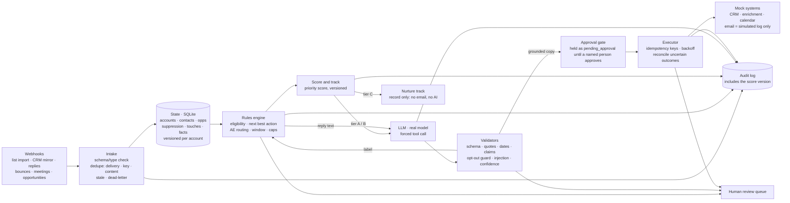

# Clara challenge — Growth Orchestration System

A working vertical slice of a system that decides, for each company, **the next best action and whether it is safe to
automate it**, sized for 50,000 companies a month:

```
event → state → decision → AI/rules → action → audit
```

The model proposes and deterministic code decides. The AI reads replies and writes one opening line from verified facts;
rules choose eligibility, the action, the sales exec and whether anything is sent. Every outreach email is held until a
named person approves it, and goes only to a simulated log: **nothing is ever sent**. All data is synthetic.

**Live site:** https://clara-growth-orchestration.netlify.app

## The idea in one minute

A growth team that targets thousands of companies a month cannot look at each one. Someone has to decide, account by account, whether
it is safe to contact, who should do it and what to say, and that slow, repetitive work is where mistakes happen: a customer gets a
cold email, an opt-out is ignored, the same message goes out twice.

This system takes that decision over, and keeps people for the cases that need judgment:

- **It listens to events** (a company is targeted, a prospect replies, an email bounces) and keeps each company's state.
- **Rules decide**: who is eligible, what the next best action is, which sales exec gets the account, and when. They are plain,
  testable and the same every time. A score picks the track among eligible companies: a personal outreach email, or the slower
  nurture path.
- **The AI helps in two small places**: it reads a prospect's reply (what they meant, what they stated) and it writes one opening
  line from a verified fact. Its answers are checked before anything uses them; if a check fails, the account goes to a person or
  gets the approved template.
- **A person approves every outreach email.** Nothing is ever sent: even an approved email goes only to a simulated log.
- **Everything is audited**, so any decision can be traced back to the event, the rule and the score version behind it.

The rest of this page says where to see each piece.

## Start here

- **2 minutes.** Open the site. *Command Center* runs the whole month by itself in 25 seconds and ends on what it means for the
  team. Then *Live Demo → Scenarios* and pick *Unsubscribe arrives late*.
- **5 minutes.** Add *Live Demo → Leads* (open a company, press **Ask Claude**), *Decisions → Prioritization* (edit the weights, compare
  two scoring versions) and *AI & Safety → Evaluation*. The table below says what each section does.
- **Architecture and tradeoffs.** The [architecture diagram and key decisions](#architecture) are below; the [decision log](growth-orchestrator/docs/DECISION_LOG.md) has what was not built and why.
- **15 minutes.** Read the [decision log](growth-orchestrator/docs/DECISION_LOG.md) (what was not built and why, the biggest tradeoff and
  the biggest production risk) and the [measurement plan](growth-orchestrator/docs/MEASUREMENT_PLAN.md) (how we would know it works).

## Try it yourself

Python 3.11+ and nothing to install. Every command runs from `growth-orchestrator/`.

```bash
git clone https://github.com/apogeoconsara/portafolioclarachallenge.git
cd portafolioclarachallenge/growth-orchestrator
python3 -m orchestrator demo                       # six flows step by step: success, duplicate, failure, unsafe AI...
python3 -m orchestrator stream                     # the 561 sample deliveries through the engine, summarised
python3 -m unittest discover -s tests -t .         # the tests (5 skip without the 50k world)
cd .. && python3 -m http.server 8000 --directory public   # the site, at http://localhost:8000
```

Sending a webhook yourself and approving the email (`serve`, sample world), generating the 50k world and using the real model with your
own key are in [setup and usage](growth-orchestrator/README.md#setup-and-usage). The live AI buttons need the deployed site, because
they call a Netlify function.

## What the challenge asks, and where to see it

<details>
<summary>Show the table</summary>

| The challenge asks for | Where to see it on the site | Where it is proven |
|---|---|---|
| Events that trigger the system | Every journey in *Live Demo → Scenarios* starts with a webhook; *Operations → Event stream* | `orchestrator serve`, intake tests |
| Persistent account state and a next best action | *Decisions → Account trace*; any lead page in *Live Demo → Leads* | 89 golden scenarios; the engine agrees with the answer key on all 55,959 actions of the 50,000-company world |
| A meaningful LLM capability | *AI & Safety → Try a reply* (reads a reply and extracts facts) and the opening-line panel (personalization from verified facts only) | `growth-orchestrator/docs/AI.md`; the live function `netlify/functions/orchestrator-llm.mjs` |
| Structured, validated AI output | *AI & Safety → Evaluation*, check 2: 220 recorded outputs, good and defective | the validators and their tests |
| Mock external systems (CRM, enrichment, outreach, calendar) | The "outside systems" lane of each scenario (CRM, email log) with its idempotency key and status | `growth-orchestrator/data/seed/mock_api_contracts.json` |
| Duplicate and idempotency protection | *Same webhook twice*; *Email API fails* (the retry reuses the same key, so one email) | goldens G040 to G042, G070 |
| A realistic failure and retry | *Email API fails*, *CRM fails (503)*, *CRM says "unknown"*, *CRM changed (409)* | goldens G070 to G078 and G110 to G117 |
| An ambiguous or unsafe AI case | *"Interested, but stop"*, *Vague reply*, *AI output cut off*; and the one recorded case that gets through, explained | goldens G064 to G067 |
| Events that arrive late or out of order | *Unsubscribe arrives a day late* | goldens G047, G048 |
| An AI evaluation | *AI & Safety → Evaluation*: 18 live cases and 220 recorded outputs, kept apart | `growth-orchestrator/evals/results/`, `growth-orchestrator/docs/AI.md` |
| Automated tests | Run in CI on every push to `main` and every pull request | 178 tests, including a browser test (`growth-orchestrator/tests/`) |
| Scale to 50,000 companies a month | *Command Center* (the month, run) and *Operations → Metrics* | [production notes](growth-orchestrator/docs/PRODUCTION.md) |
| How impact would be measured | *Command Center → Measuring impact* | [measurement plan](growth-orchestrator/docs/MEASUREMENT_PLAN.md) |

The full map, requirement by requirement, is in [growth-orchestrator/data/TRACEABILITY.md](growth-orchestrator/data/TRACEABILITY.md).

</details>

## Architecture



Code map: `growth-orchestrator/orchestrator/` is the engine (`rules.py` decides, `ai/` proposes and validates, `executor.py` and `mocks.py`
act), `growth-orchestrator/generator/` builds the synthetic world, `netlify/functions/orchestrator-llm.mjs` is the live AI endpoint (key
server-side, no email code) and `public/` is the page.

## Key decisions and tradeoffs

- **The model proposes, deterministic code decides.** The model labels and extracts; rules choose the action, the AE,
  the timing and whether anything is sent. Opt-outs are honoured by rules even if the model disagrees or is down.
- **Safety over automation rate.** Anything uncertain goes to a human queue instead of being guessed.
- **Exactly-once by idempotency key plus lookup before retry**, so uncertain outcomes never become double sends.
- **No outreach email executes without a person.** The engine drafts and holds every outreach email (first or follow-up)
  as `pending_approval`; only `approve()` by a named reviewer releases it to the mock send, and the executor refuses
  anything unapproved (tested: zero sends on the whole sample stream until someone approves). The Approval Queue page shows
  the reviewer's side, but its decisions stay in the browser: a static page cannot call the engine. There is no reviewer
  sign-in or production queue.
- **Recorded, simulated and live are always labelled.** Operations metrics come from running all 55,959 events through
  the engine with an offline stand-in for the model, not a real one.

What I did not build, where I did not use AI, the biggest tradeoff and the biggest production risk are in the
[decision log](growth-orchestrator/docs/DECISION_LOG.md).

## Section by section

<details>
<summary>Show the table</summary>

Follow the left menu. Every view says whether what you see is **recorded** (a stored run of the real engine), **simulated** (a
stand-in or an assumption) or **live** (the real model, called when you press a button).

| Section | What it does | What to look at |
|---|---|---|
| **Command Center** | The whole system on one screen: what it means for the team, how the month went for 50,000 companies, and how its impact would be measured. | The month runs by itself in 25 seconds (a recorded run) and ends on 33,267 companies decided automatically, 7,983 that need a person and 8,750 blocked. *Measuring impact* explains the A against B plan and where the AI has to earn its place. |
| **Live Demo → Leads** | Twelve synthetic companies, four per group (Top priority, Standard, Nurture), each run through the engine as a new target. | Open one: its score and why, the routing decision, the simulated CRM record, the opening line the AI wrote from a verified fact, and which facts the rules blocked and why. The button asks the real model. |
| **Live Demo → Scenarios** | Sixteen situations drawn as a journey that plays by itself: a normal day, careful AI, who must not be contacted, routing to a sales exec, the same event twice or late, and failing systems. | *Unsubscribe arrives late* (the late opt-out cancels the draft waiting for approval), *CRM says "unknown"* (read back by key before writing again) and *AI output cut off* (the model fails, the system does not). Each one says where the AI added value, or that it did not. |
| **Decisions → Prioritization** | How a company's score is built (size, payment pain, growth signals) and what it does to the 50,000 companies. | Edit the weights and see who changes group; compare two scoring versions on the same data, with a change log. |
| **Decisions → Automation** | What the system decides by itself and the working hours that frees. | The minutes per task are editable and marked as assumptions. |
| **Decisions → Account trace** | One account, step by step: the safety checks, the score and the decision behind its next action. | Pick any account and read why it was, or was not, contacted. |
| **Approval Queue** | The reviewer's side of the human approval step: 200 prepared outreach emails held for approval. | Approve or reject (with a reason) and watch the override rate. The page keeps these decisions in the browser; the engine itself enforces `approve()` by a named person. |
| **AI & Safety → Try a reply** | The two jobs the AI has, with the real model. | Paste a prospect reply and see the model read it, the validator check it and the rules choose the action; then the personalized opening line, where each fact is allowed or blocked by the rules. |
| **AI & Safety → Evaluation** | Two separate checks: does the AI read replies correctly (18 live cases) and does the safety net catch bad answers (220 recorded outputs). | The results as cards, why two runs can differ, and the one case that gets through and why a person reviews it. |
| **Operations → Metrics** | The whole month of events as operating numbers. | Automation and review rates, failures, duplicates ignored, dead letters and the AI cost assumption (an offline stand-in for the model, so this measures the safety layer, not a real model). |
| **Operations → Event stream** | All 561 deliveries of the 500-account sample, including duplicates, garbage, late events and every mock failure, through one engine instance. | How many decisions match the independent answer key (561 of 561), how each delivery was handled and what it ended as, and how many items went to a person or to the dead-letter queue. |
| **Architecture** | How the pieces fit and how this meets the challenge. | The diagram, a table of every requirement and where to see it and where it is proven, the 89 situations behind the tests and the reference flows. |

</details>

## What is real, simulated and live

- **Real:** the engine and its decisions, the scores, the audit trail, the validators and the 178 tests.
- **Recorded:** every scenario, lead and metric on the site is a stored run of that engine. The model's answer inside those runs is
  an offline stand-in that restates the first usable fact, not a real model.
- **Simulated:** the CRM, enrichment, calendar and email (mock systems with a real-looking contract), the impact numbers (they rest on
  stated assumptions) and the scripted reviewer in the recorded runs.
- **Live:** only what the buttons call: the reply and opening-line panels, the live eval and the Claude button on each lead and
  scenario. They use the real model through a Netlify function that holds the key and has no email code.

## What is not built

A reviewer sign-in and a production approval queue (the Approval Queue page keeps decisions in the browser; the engine enforces
`approve()` by a named person); real CRM, calendar and email integrations; a model-accuracy claim (the live eval is one set of 18
cases that also tuned the prompt). The AI-drafted data and texts are pending the author's human review. Details and reasons are in the
decision log.

## Run it yourself

- **How to run it**: [setup and usage](growth-orchestrator/README.md#setup-and-usage) (Python 3.11+, nothing to install), including how
  to use the real model, its cost limit and when to re-run the eval.
- **Everything is in [`growth-orchestrator/`](growth-orchestrator/README.md)**: the system, the synthetic data (50,000 accounts generated
  by code), tests, AI evals and docs.
- **Web page**: `public/index.html` (data in `public/data/`, regenerated with `python3 -m orchestrator export-web`).
- **Live AI function**: `netlify/functions/orchestrator-llm.mjs` (key server-side, no email code).
